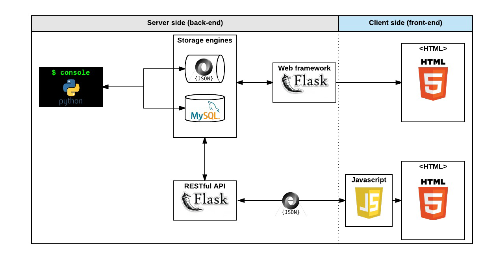

# AirBnB Clone - Version 4



## Project Overview

This is the fourth version of the AirBnB Clone project, focusing on making the website dynamic with the integration of JavaScript and front-end technologies. The web application is developed in Python using the Flask web framework, MySQL as the database, and integrated with RESTful APIs to dynamically fetch and filter places for users based on selected amenities, states, and cities.

## Author

**Bekezulu Bischops**  
- GitHub: github.com/bischops  
- Email: asive@bischops.tech

## Table of Contents

1. [Project Overview](#project-overview)
2. [Author](#author)
3. [Project Tasks](#project-tasks)
    - [0. Last Clone](#0-last-clone)
    - [1. Cash Only](#1-cash-only)
    - [2. Select Some Amenities to be Comfortable](#2-select-some-amenities-to-be-comfortable)
    - [3. API Status](#3-api-status)
    - [4. Fetch Places](#4-fetch-places)
    - [5. Filter Places by Amenity](#5-filter-places-by-amenity)
    - [6. States and Cities](#6-states-and-cities)
    - [7. Reviews](#7-reviews)
4. [Technologies Used](#technologies-used)
5. [Setup Instructions](#setup-instructions)
6. [API Documentation](#api-documentation)
7. [Usage](#usage)
8. [Acknowledgements](#acknowledgements)

## Project Tasks

### 0. Last Clone
- Fork the codebase from **AirBnB_clone_v3** and update the project to **AirBnB_clone_v4**.
- Install Flasgger if not previously installed: `sudo pip3 install flasgger`
- Add yourself as an author to the README.
- Introduce new contributions and enhancements to the README.

### 1. Cash Only
- Create a new dynamic route `/0-hbnb/` by copying and modifying existing files.
- Add a unique cache-busting query string to static assets using UUIDs.
- Update the `0-hbnb.py` and `0-hbnb.html` files to reflect the changes.

### 2. Select Some Amenities to be Comfortable
- Replace the static filters section with dynamic functionality.
- Integrate jQuery and handle checkbox interactions with amenities dynamically.
- Write a JavaScript script to listen for checkbox changes and update the displayed list of amenities.

### 3. API Status
- Check the status of the AirBnB API and display it on the front-end.
- Use a new endpoint to monitor API status and add a visual indicator for availability.
- Update the necessary CSS and HTML to reflect the API's status in real-time.

### 4. Fetch Places
- Modify the application to dynamically fetch places using the `/places_search` API.
- Remove the static backend Jinja rendering of places and implement dynamic loading from the front-end.
- Fetch data using `POST` requests and dynamically generate place articles based on the response.

### 5. Filter Places by Amenity
- Enable filtering of places by amenities.
- Write a script to filter the list of places based on the user's selected amenities.

### 6. States and Cities
- Add checkboxes for filtering places by states and cities.
- Dynamically fetch and display places based on the combination of selected amenities, states, and cities.

### 7. Reviews
- Add a feature to toggle the display of reviews for each place.
- Write a JavaScript function that toggles between fetching and displaying reviews when the "show" button is clicked.

## Technologies Used

- Python 3
- Flask
- Jinja2
- MySQL
- JavaScript (JQuery)
- HTML5/CSS3
- RESTful API
- Flasgger (API documentation)

## Setup Instructions

1. Clone this repository:  
   ```bash
   git clone https://github.com/bischops/AirBnB_clone_v4.git
   ```

2. Install dependencies:  
   ```bash
   sudo pip3 install -r requirements.txt
   ```

3. Set up the MySQL database and create the necessary environment variables:  
   ```bash
   export HBNB_MYSQL_USER=hbnb_dev
   export HBNB_MYSQL_PWD=hbnb_dev_pwd
   export HBNB_MYSQL_HOST=localhost
   export HBNB_MYSQL_DB=hbnb_dev_db
   export HBNB_TYPE_STORAGE=db
   ```

4. Run the API:  
   ```bash
   HBNB_MYSQL_USER=hbnb_dev HBNB_MYSQL_PWD=hbnb_dev_pwd HBNB_MYSQL_HOST=localhost HBNB_MYSQL_DB=hbnb_dev_db HBNB_TYPE_STORAGE=db HBNB_API_PORT=5001 python3 -m api.v1.app
   ```

5. Run the Flask web application:  
   ```bash
   python3 -m web_dynamic.0-hbnb
   ```

## API Documentation

The API is documented using **Flasgger**. You can access the API documentation by navigating to `/apidocs` when the application is running.

## Usage

- **View Available Places:** Visit the home page and see the list of available places dynamically loaded from the backend.
- **Filter by Amenities:** Check amenities to filter the list of places that match your criteria.
- **Check API Status:** The API status indicator will show whether the backend API is available.
- **Toggle Reviews:** Show and hide reviews for a place using the toggle button.

## Acknowledgements

This project is part of the **Holberton School** curriculum. It was designed to teach students about full-stack development, integrating the front-end and back-end components into a dynamic web application.
